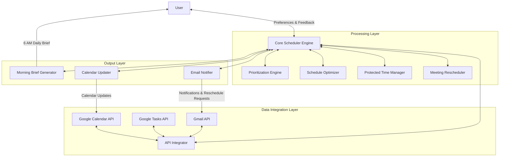
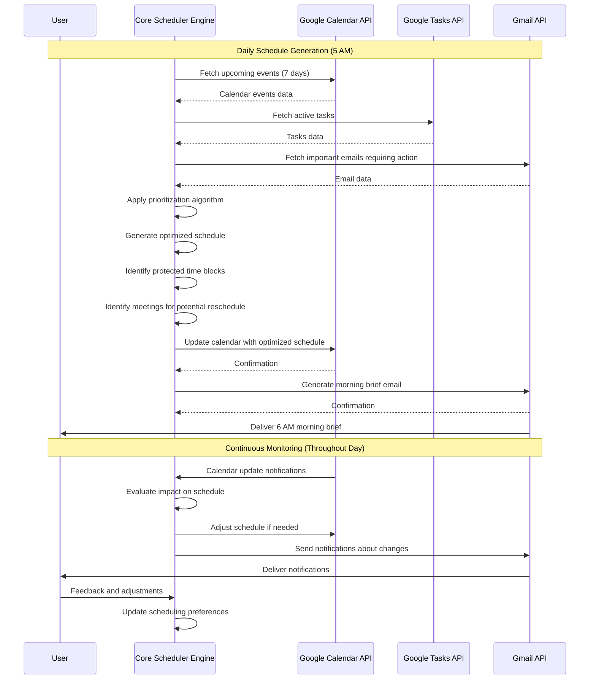
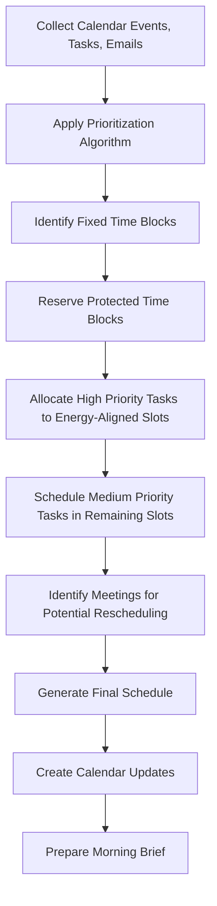
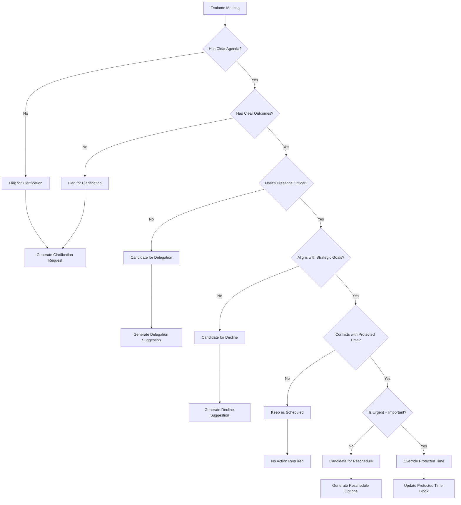

# Dynamic Scheduler Agent: System Architecture

## 1. System Overview

The Dynamic Scheduler Agent is an intelligent time management system designed to optimize a user's daily schedule by integrating with Google Calendar, Google Tasks, and Gmail. The system aims to maximize high-leverage outputs while protecting time for deep thinking, leadership, and personal wellbeing.

The agent operates on the following core principles:

1. **Energy-Based Scheduling**: Tasks are aligned with the user's natural energy patterns throughout the day
2. **Strategic Prioritization**: Activities are prioritized based on their importance and urgency
3. **Protected Time Blocks**: Critical time for deep work, personal wellbeing, and family is preserved
4. **Goal Alignment**: Daily activities are connected to strategic goals
5. **Adaptive Rescheduling**: Meetings without clear outcomes are candidates for rescheduling

The system runs daily to generate an optimized schedule, delivers a morning brief at 6 AM, and continuously monitors for changes that may require schedule adjustments throughout the day.

## 2. Component Diagram



## 3. Data Flow Diagram



## 4. Prioritization Algorithm

The prioritization algorithm implements the user's rules to determine the relative importance of tasks and meetings. This algorithm is central to the Dynamic Scheduler's decision-making process.

### 4.1 Task Classification Matrix

Tasks and meetings are classified along two dimensions:

```
                  IMPORTANCE
              Low           High
         ┌─────────────┬─────────────┐
         │             │             │
    High │ URGENT      │ URGENT      │
         │ NOT         │ AND         │
         │ IMPORTANT   │ IMPORTANT   │
URGENCY  │             │             │
         ├─────────────┼─────────────┤
         │             │             │
    Low  │ NOT URGENT  │ IMPORTANT   │
         │ NOT         │ NOT         │
         │ IMPORTANT   │ URGENT      │
         │             │             │
         └─────────────┴─────────────┘
```

### 4.2 Scoring System

Each task or meeting receives a composite score based on:

1. **Quadrant Score** (0-100):
   - Urgent + Important: 90-100
   - Important, Not Urgent: 70-89
   - Urgent, Not Important: 40-69
   - Neither Urgent nor Important: 0-39

2. **Energy Alignment** (0-100):
   - Perfect alignment with user's energy pattern: 100
   - Moderate alignment: 50-75
   - Poor alignment: 0-49

3. **Goal Alignment** (0-100):
   - Direct contribution to North Star goal: 80-100
   - Contribution to secondary focus areas: 50-79
   - Indirect or minimal contribution: 0-49

4. **Final Priority Score** = (0.5 × Quadrant Score) + (0.3 × Energy Alignment) + (0.2 × Goal Alignment)

### 4.3 Prioritization Rules Implementation

```python
def calculate_priority(task, user_preferences):
    # Determine quadrant
    if task.is_urgent and task.is_important:
        quadrant_score = 95  # Urgent + Important
    elif task.is_important and not task.is_urgent:
        quadrant_score = 80  # Important, Not Urgent
    elif task.is_urgent and not task.is_important:
        quadrant_score = 60  # Urgent, Not Important
    else:
        quadrant_score = 30  # Neither Urgent nor Important
    
    # Calculate energy alignment
    energy_alignment = calculate_energy_alignment(task, user_preferences.energy_patterns)
    
    # Calculate goal alignment
    goal_alignment = calculate_goal_alignment(task, user_preferences.goals)
    
    # Calculate final priority score
    final_score = (0.5 * quadrant_score) + (0.3 * energy_alignment) + (0.2 * goal_alignment)
    
    return final_score
```

### 4.4 Meeting Evaluation Criteria

Meetings are evaluated based on:

1. **Clear Agenda**: Does the meeting have a defined agenda? (Yes/No)
2. **Expected Outcomes**: Are there clear expected outcomes? (Yes/No)
3. **Attendee Necessity**: Is the user's presence critical? (Scale 1-5)
4. **Strategic Alignment**: How well does the meeting align with strategic goals? (Scale 1-5)
5. **Decision Authority**: Will decisions be made in this meeting? (Yes/No)

Meetings scoring below a threshold become candidates for rescheduling or delegation.

## 5. Schedule Optimization Process

The schedule optimization process transforms the prioritized tasks and meetings into an optimal daily schedule that respects the user's preferences and constraints.

### 5.1 Optimization Pipeline



### 5.2 Time Block Allocation Rules

1. **Fixed Time Blocks**:
   - Existing meetings with multiple attendees
   - In-person meetings (Tuesday-Thursday, 12-4 PM)
   - CrossFit (9:30-10:30 AM daily)
   - Family time (7-10 PM daily)

2. **Protected Time Blocks**:
   - Deep work (1 hour daily, preferably morning)
   - Research time (6-8 AM daily)
   - Learning time (10 PM-12 AM daily)

3. **Flexible Time Blocks**:
   - Admin time (4-7 PM, can be adjusted if needed)
   - Call time (8-9 AM, can be adjusted if needed)

4. **Energy-Aligned Task Allocation**:
   - Morning (6-9 AM): Research, strategic thinking
   - Mid-morning (11 AM-12 PM): Meetings requiring decision-making
   - Afternoon (12-4 PM): Collaborative meetings, especially in-person
   - Evening (5-7 PM): Administrative tasks, action items
   - Late evening (10 PM-12 AM): Learning, reflection

### 5.3 Conflict Resolution Strategy

When scheduling conflicts arise, the system resolves them using the following hierarchy:

1. Protected time blocks are preserved unless an Urgent+Important task/meeting conflicts
2. Higher priority score tasks/meetings take precedence over lower priority ones
3. Tasks with fixed deadlines take precedence over flexible deadlines
4. In-person meetings take precedence over virtual meetings
5. Meetings with more attendees take precedence over fewer attendees
6. Longer duration meetings are harder to reschedule than shorter ones

## 6. Morning Brief Generation

The morning brief is delivered at 6 AM daily to provide the user with an overview of their optimized schedule and key information for the day.

### 6.1 Morning Brief Components

1. **Today's Schedule Overview**:
   - Timeline visualization of the day
   - Protected time blocks highlighted
   - Meeting blocks with clear indicators of importance

2. **Key Metrics**:
   - Deep work time allocation
   - Progress toward North Star goal
   - Balance score (work vs. personal time)

3. **Critical Tasks**:
   - Top 3 most important tasks for the day
   - Estimated time required for each

4. **Meeting Intelligence**:
   - Preparation notes for each meeting
   - Suggested meeting reschedule candidates
   - Decision points expected in meetings

5. **Recent Context**:
   - Important emails requiring response
   - Follow-ups from yesterday's meetings
   - Upcoming deadlines

### 6.2 Brief Generation Process

```python
def generate_morning_brief(optimized_schedule, user_preferences):
    brief = {
        "date": datetime.now().strftime("%A, %B %d, %Y"),
        "schedule_overview": generate_schedule_visualization(optimized_schedule),
        "key_metrics": calculate_daily_metrics(optimized_schedule, user_preferences),
        "critical_tasks": identify_top_tasks(optimized_schedule, limit=3),
        "meeting_intelligence": generate_meeting_insights(optimized_schedule),
        "recent_context": gather_recent_context()
    }
    
    return format_morning_brief(brief)
```

### 6.3 Brief Delivery

The morning brief is delivered via email at 6 AM, timed to coincide with the user's morning research time. The email is formatted for easy reading on mobile devices and includes actionable links to:

1. Approve the proposed schedule
2. Make adjustments to the schedule
3. Provide feedback on the scheduling algorithm
4. Access detailed meeting preparation materials

## 7. Meeting Rescheduling Logic

The meeting rescheduling component identifies meetings that could be rescheduled, delegated, or declined to optimize the user's time.

### 7.1 Meeting Evaluation Decision Tree



### 7.2 Rescheduling Parameters

When a meeting is identified for rescheduling, the system generates alternative time slots based on:

1. **Attendee Availability**: Check calendar availability of all attendees
2. **Energy Alignment**: Propose times that align with the meeting type and user's energy patterns
3. **Protected Time Preservation**: Avoid conflicts with protected time blocks
4. **Batch Processing**: Try to batch similar meetings together to minimize context switching
5. **Travel Considerations**: For in-person meetings, account for travel time

### 7.3 Communication Templates

The system uses pre-defined templates for different rescheduling scenarios:

1. **Clarification Request**:
   ```
   Subject: Agenda Clarification for [Meeting Title]
   
   Hi [Organizer],
   
   I noticed our upcoming meeting on [Date] doesn't have a clear agenda/expected outcomes. 
   Could you share what we'll be covering and what decisions need to be made?
   
   This will help me prepare appropriately and ensure we make the most of our time together.
   
   Thanks,
   [User Name]
   ```

2. **Delegation Suggestion**:
   ```
   Subject: Regarding [Meeting Title]
   
   Hi [Organizer],
   
   I believe [Delegate Name] would be better positioned to represent our interests in the 
   upcoming [Meeting Title] on [Date] given their expertise in this area.
   
   I've briefed them on the context, and they're prepared to attend. Please let me know if 
   you have any concerns with this arrangement.
   
   Best regards,
   [User Name]
   ```

3. **Reschedule Request**:
   ```
   Subject: Rescheduling Request for [Meeting Title]
   
   Hi [Organizer],
   
   I have a conflict with our scheduled meeting on [Date]. Would it be possible to 
   reschedule to one of these alternative times?
   
   - [Option 1]
   - [Option 2]
   - [Option 3]
   
   These times would allow me to give this meeting my full attention.
   
   Thanks for your understanding,
   [User Name]
   ```

## 8. Protected Time Management

The Protected Time Manager ensures that essential blocks of time are preserved for deep work, personal wellbeing, and family commitments.

### 8.1 Protected Time Categories

1. **Deep Work** (1 hour daily):
   - Default: 7-8 AM during research time
   - Alternative: 11 AM-12 PM if morning is unavailable
   - Purpose: Strategic thinking, creative problem-solving

2. **Physical Wellbeing** (1 hour daily):
   - Fixed: 9:30-10:30 AM (CrossFit)
   - Non-negotiable except for extreme circumstances

3. **Family Time** (3 hours daily):
   - Fixed: 7-10 PM
   - Highest protection level, rarely overridden

4. **Learning Time** (2 hours daily):
   - Fixed: 10 PM-12 AM
   - Medium protection level

5. **Research Time** (2 hours daily):
   - Fixed: 6-8 AM
   - Medium protection level

### 8.2 Protection Levels and Override Conditions

```
Protection Level | Override Conditions
----------------|--------------------
Highest         | Only life/business critical emergencies
High            | Only Urgent+Important quadrant items
Medium          | Urgent+Important or Important items with deadline
Low             | Any higher priority item can override
```

### 8.3 Protected Time Enforcement Algorithm

```python
def enforce_protected_time(schedule, protected_blocks, override_candidates):
    for block in protected_blocks:
        # Check if any override candidates conflict with this protected block
        conflicts = find_conflicts(block, override_candidates)
        
        if not conflicts:
            # No conflicts, add protected block to schedule
            schedule.add_block(block)
            continue
        
        # Evaluate each conflict against override conditions
        for conflict in conflicts:
            if can_override_protection(block.protection_level, conflict.priority):
                # Allow override, but mark as exception
                schedule.add_block(conflict)
                log_protection_override(block, conflict)
            else:
                # Maintain protection, find alternative for conflict
                alternative_slot = find_alternative_slot(conflict, schedule)
                if alternative_slot:
                    conflict.reschedule(alternative_slot)
                    schedule.add_block(conflict)
                else:
                    # Cannot reschedule, add to unscheduled items
                    schedule.add_to_unscheduled(conflict)
    
    return schedule
```

### 8.4 Calendar Visualization

Protected time blocks are visually distinguished in the calendar using:

1. **Color Coding**:
   - Deep Work: Purple
   - Physical Wellbeing: Green
   - Family Time: Blue
   - Learning Time: Orange
   - Research Time: Yellow

2. **Block Naming Convention**:
   - [PROTECTED] Deep Work: Strategic Planning
   - [PROTECTED] CrossFit
   - [PROTECTED] Family Time
   - [PROTECTED] Learning: AI Developments
   - [PROTECTED] Research: AI Tools

3. **Visibility Settings**:
   - Internal blocks: Shown as busy to external viewers
   - Details visible only to the user

## 9. Implementation Plan

### 9.1 Development Phases

1. **Phase 1: Core Infrastructure**
   - Set up Google API authentication
   - Implement data retrieval from Calendar, Tasks, and Gmail
   - Create basic data models for events, tasks, and preferences

2. **Phase 2: Prioritization Engine**
   - Implement the prioritization algorithm
   - Develop the meeting evaluation criteria
   - Create the task classification system

3. **Phase 3: Schedule Optimization**
   - Implement the time block allocation rules
   - Develop the conflict resolution strategy
   - Create the protected time enforcement algorithm

4. **Phase 4: Output Generation**
   - Implement the morning brief generator
   - Develop the calendar update mechanism
   - Create the email notification system

5. **Phase 5: Feedback Loop**
   - Implement user feedback collection
   - Develop algorithm adjustment based on feedback
   - Create performance metrics tracking

### 9.2 Technical Requirements

1. **Programming Language**: Python 3.8+
2. **Key Libraries**:
   - Google API Client Library
   - OAuth2 for authentication
   - Pandas for data manipulation
   - Flask for potential web interface
   - APScheduler for scheduling jobs

3. **Deployment Options**:
   - Cloud-based (AWS Lambda or Google Cloud Functions)
   - Self-hosted server
   - Local machine with scheduled execution

### 9.3 Security Considerations

1. **Authentication**: OAuth 2.0 with refresh tokens
2. **Data Storage**: Encrypted local storage for tokens and preferences
3. **API Access**: Minimal scopes required for functionality
4. **Privacy**: No data shared with third parties

## 10. Conclusion

The Dynamic Scheduler Agent architecture provides a comprehensive framework for managing the user's time with the goal of maximizing high-leverage outputs while protecting time for deep thinking, leadership, and personal wellbeing. By integrating with Google Calendar, Google Tasks, and Gmail, the system can generate optimized daily schedules that align with the user's energy patterns, prioritize important tasks, and preserve essential protected time blocks.

The system's key strengths include:

1. **Energy-Based Scheduling**: Tasks are aligned with the user's natural energy patterns
2. **Strategic Prioritization**: Activities are prioritized based on importance and urgency
3. **Protected Time Management**: Critical time blocks are preserved
4. **Intelligent Meeting Handling**: Meetings without clear outcomes are identified for rescheduling
5. **Goal Alignment**: Daily activities are connected to strategic goals

With this architecture, the Dynamic Scheduler Agent will help the user achieve their North Star goal of generating 10 RAIN ventures AI impact sessions and 5 Launch Labs projects generating $250K, while also establishing RAIN ventures as a leading AI-first technology venture studio.
